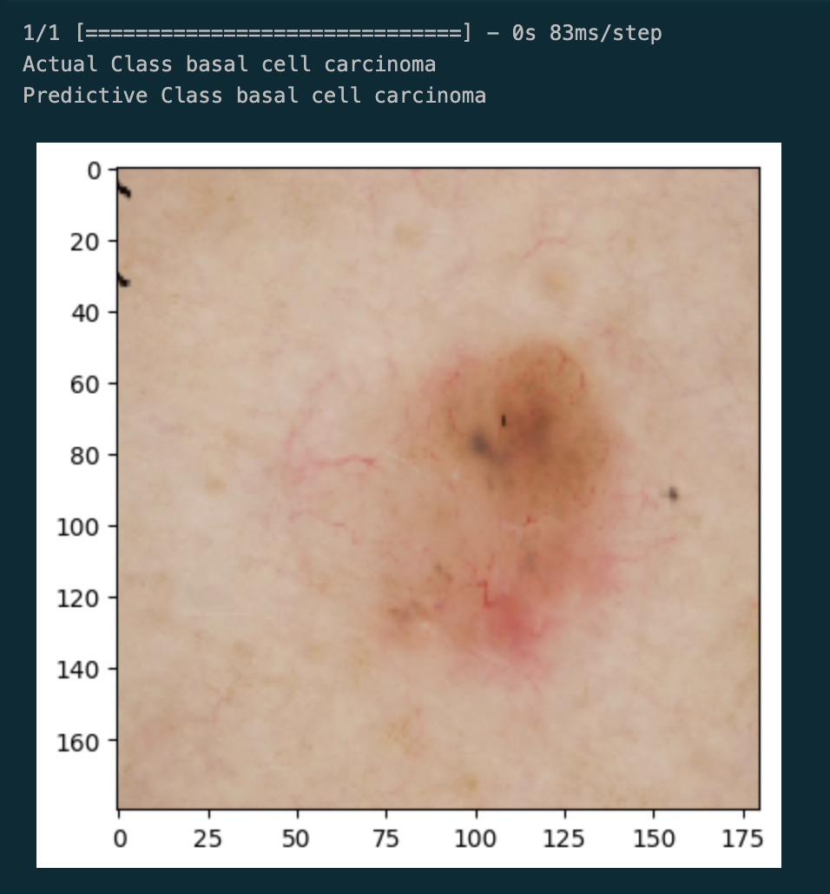

# Melanome-Deep-Learning
Explore my GitHub repository showcasing a comprehensive melanoma classification, providing valuable insights into their performance and potential clinical applications.

# Result

## Data link

